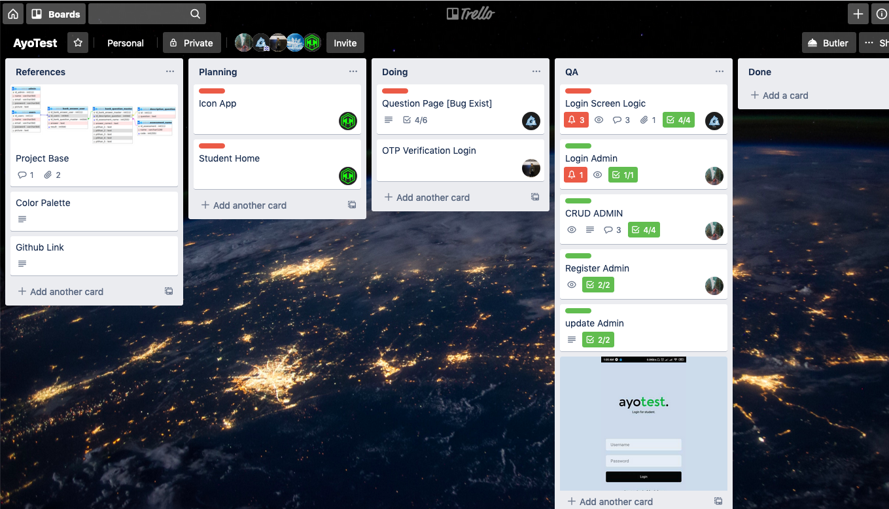

# AyoTest-api
This project is Backend for this project of https://github.com/anasarifin/ayotest

<h1 align='center'>Ayo test  Test online with react native</h1>

    

 
 

## Introduction

Ayochat is test online to connecting teacher and their student, this app's is team project based and mabe by me and my friend's.

## Requirements

1. <a href="https://nodejs.org/en/download/">Node Js</a>
2. Node_modules `npm install` or `yarn install`

## How to Install

1. Clone this project
2. Open app's directory in Terminal
3. Type `npm install` or `yarn install`
4. Type `react-native run-android`

## Screenshot from the App

  
      <image width="200" src="./screenshot/1.png" />
      <image width="200" src="./screenshot/2.png" />
      <image width="200" src="./screenshot/3.png" />
     
      
  

  
      <image width="200" src="./screenshot/4.png" />
        <image width="200" src="./screenshot/5.png" />
      <image width="200" src="./screenshot/6.png" />
      
  

  
      <image width="200" src="./screenshot/7.png" />
        <image width="200" src="./screenshot/8.png" />
      <image width="200" src="./screenshot/9.png" />
      
  

